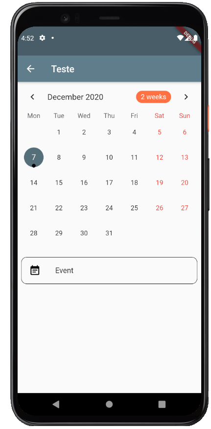

# todo-app-flutter (Closed)
 Currently implementing this app with Clean Architecture, TDD and BLoC
 
## Features:
- Add tasks, events and notes
- Daily view
- Monthly type calendar view
- Complete tasks and events
- Delete individual task, event or note by sliding to the left
- Swipe left or right to go forwards or backwards a day
- Clear todo list
- Move Todo's to the next day sliding to the right

